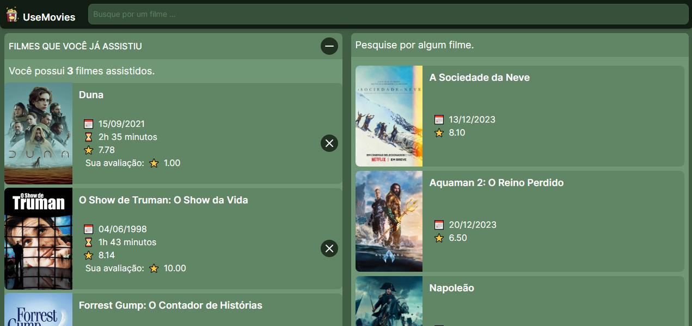

## 🖥 Desktop

## 📱 Mobile

## 📌 Sobre

**UseMovies** é um projeto para pesquisa de filmes.

## 🚀 Tecnologias utilizadas

O projeto foi desenvolvido utilizando as seguintes tecnologias:

- [Next](https://nextjs.org/)
- [Typescript](https://www.typescriptlang.org/)
- [Tailwindcss](https://tailwindcss.com/)
- [React Query](https://tanstack.com/query/v3/)

## 💻 O projeto pode ser vizualizado acessando o seguinte link

<https://use-movies-two.vercel.app/>

## 📦  Exemplo

